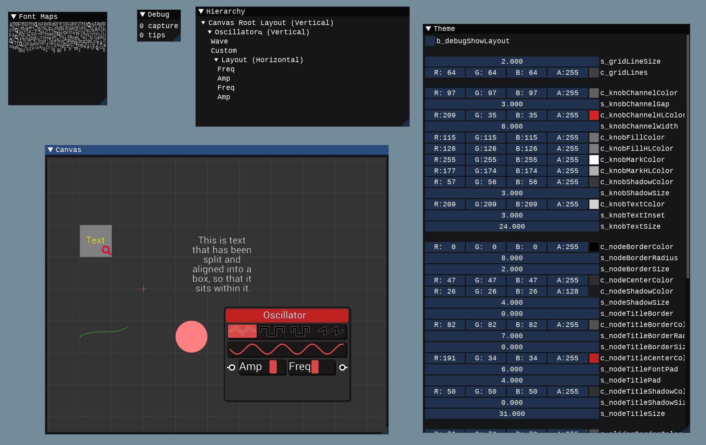

[NodeGraph](https://github.com/Rezonality/nodegraph) - A simple Directed Graph, with SVG UI
===================================================================================================
[](https://github.com/Rezonality/nodegraph/actions?query=workflow%3ABuilds)
[](https://github.com/Rezonality/nodegraph/blob/master/LICENSE)
[](https://www.codacy.com/gh/Rezonality/nodegraph/dashboard?utm_source=github.com&amp;utm_medium=referral&amp;utm_content=Rezonality/nodegraph&amp;utm_campaign=Badge_Grade)
[](https://www.codacy.com/gh/Rezonality/nodegraph/dashboard?utm_source=github.com&utm_medium=referral&utm_content=Rezonality/nodegraph&utm_campaign=Badge_Coverage)
[](https://codecov.io/gh/Rezonality/nodegraph)
[](https://gitter.im/Rezonality/Nodegraph?utm_source=badge&utm_medium=badge&utm_campaign=pr-badge)

Nodegraph is a basic directed graph, used in my live coding project.  It is a work in progress.  The nodes in the graph are evaluated using a 'Pull' architecture, and support concepts of Flow and Control data.  The included sample application shows the node UI you can build from the graph specification. It supports rotary knobs of linear and non-linear type, buttons and sliders.  There is currently no way to build the graph visually, but it is a work in progress.  You can currently generate visualizations of the graph and control input parameters.  The intended use-case is a graph representing an audio synthesizer; you can find that project at [MAudio](https://github.com/Rezonality/MAudio) when it is published.  This project is cross platform and with a C++17 compiler should build on Mac, Linux and Windows.
kk


To build this project, first build the MUtils project in a parallel directory: [MUtils](https://github.com/Rezonality/MUtils).  This will install packages and the MUtils library.
Your folders should look like this:

root/
  vcpkg (generated by mutils build)
  mutils
  nodegraph

Then run the following scripts inside the nodegraph folder

``` bash
config_all.bat OR config_all.sh
build_all.bat OR build_all.sh
```

Now in your project CMakeLists.txt, you can add the following to reference the library and pull in all the header paths.  Note there are no include/library defines; the target_link_libraries is enough to pull all the necessary things in.  See the example application for how this works.

``` cmake
find_package(NodeGraph REQUIRED)
...
target_link_libraries(MyApp PRIVATE NodeGraph::NodeGraph)
```


